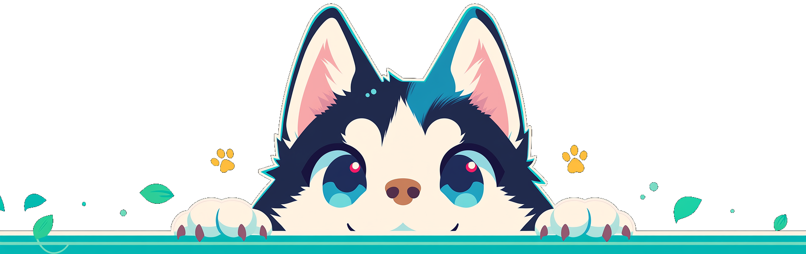

## 🧰 Tech Stack

  
  
  
  
  

<picture>
  <source media="(prefers-color-scheme: dark)" srcset="https://cdn.simpleicons.org/github/FFFFFF">
  
</picture>

<picture>
  <source media="(prefers-color-scheme: dark)" srcset="https://cdn.simpleicons.org/vercel/FFFFFF">
  
</picture>

<picture>
  <source media="(prefers-color-scheme: dark)" srcset="https://cdn.simpleicons.org/resend/FFFFFF">
  
</picture>

